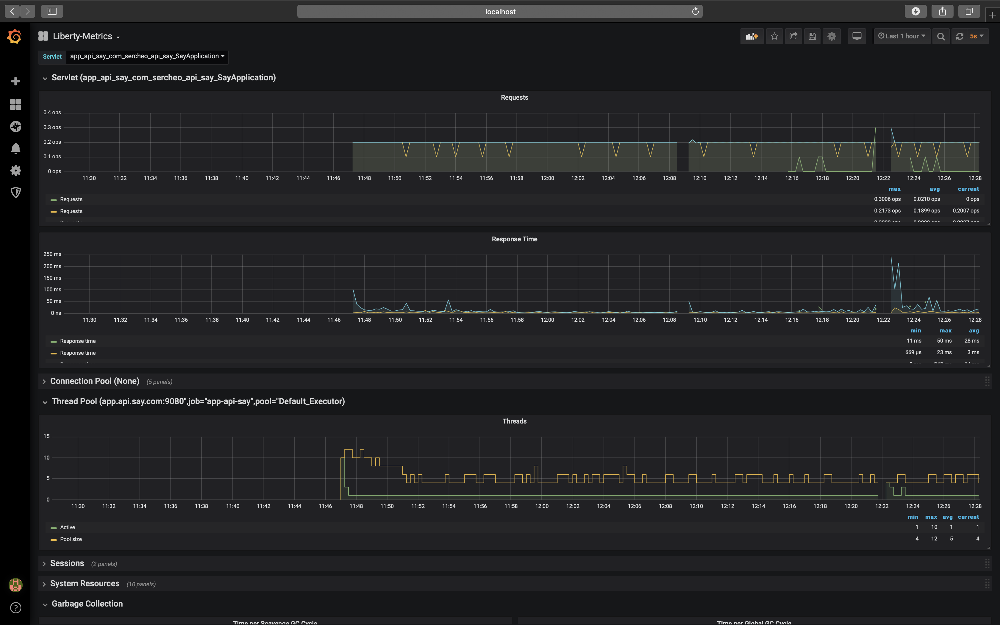

# openliberty-grafana


This example show dashboard created for Grafana specialized for monitoring:

* Servlet
* Connection Pool
* Thread Pool
* Sessions
* System Resources
* Garbage Collections



## Getting Started

For compile project execute on terminal:

```bash
cd app-api-say
mvn clean install
```

## Deployment

For create containers with app execute on terminal:

```bash
docker compose up -d --build
```

## Resources

For navigate to console Grafana dashboard:

Open Url [Grafana Console](http://localhost:3000/login)

Credentials:

* User: **_admin_**
* Password: **_P@ssw0rd_**

For create register and visualize metrics execute:

```bash
curl -H "Content-Type: application/json" -X POST http://localhost:9080/apiSay/say/sergio
curl -H "Content-Type: application/json" -X GET http://localhost:9080/apiSay/say
```

For get current metrics:

```bash
curl -X GET http://localhost:9080/metrics
```

More details on [Web Grafana](https://grafana.com/grafana/dashboards/11456)